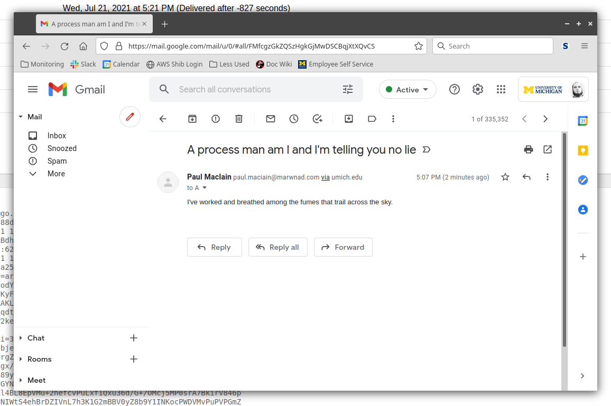
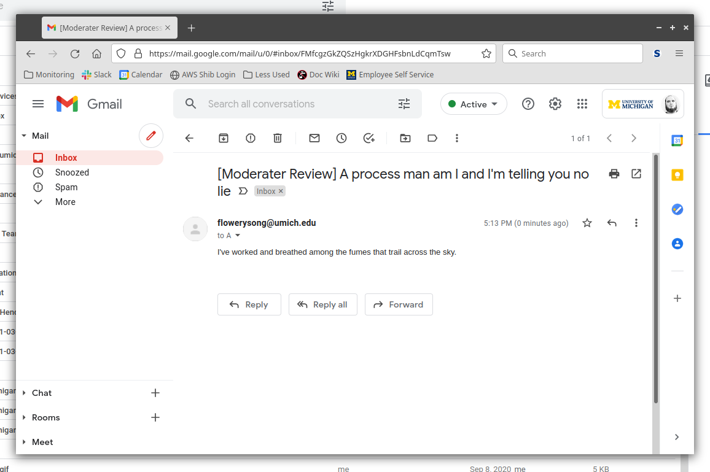
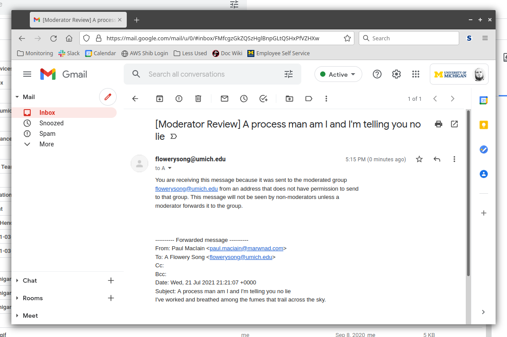

# Goal

Provide an indicator that a message a user received was subject to
moderation and they might want to take action.

# Possible Solutions

The details of each proposal can be tweaked, but broadly speaking there are
three viable ways to transform a message when it is subject to moderation.

The following sample message has been used to demonstrate the
necessary modifications:

```
From: Paul MacIain <paul.maciain@marwnad.com>
To: A Flowery Song <flowerysong@umich.edu>
Date: Wed, 21 Jul 2021 21:21:07 +0000
Subject: A process man am I and I'm telling you no lie
Message-ID: <20210721212107@vereveel.marwnad.com>
DKIM-Signature: v=1; d=marwnad.com;

I've worked and breathed among the fumes that trail across the sky.
```

## Solution 1: Add custom header(s)

```
SIMTA-Moderated-For: <flowerysong@umich.edu>
From: Paul MacIain <paul.maciain@marwnad.com>
To: A Flowery Song <flowerysong@umich.edu>
Date: Wed, 21 Jul 2021 21:21:07 +0000
Subject: A process man am I and I'm telling you no lie
Message-ID: <20210721212107@vereveel.marwnad.com>
DKIM-Signature: v=1; d=marwnad.com;

I've worked and breathed among the fumes that trail across the sky.
```



### Pros
* Simplest implementation.
* Strictly additive, does not modify the original message in any way.

### Cons
* Gmail filtering cannot match headers.
* While it provides some ability for very technical users to filter
  mail that has been moderated and an indicator to staff who review the
  full message headers that it was affected by moderation, there is no
  visible indicator when viewing the message.

## Solution 2: Modify message headers

```
DKIM-Signature: v=1; d=umich.edu;
Reply-To: <paul.maciain@marwnad.com>
From: <flowerysong@umich.edu>
Subject: [Moderater Review] A process man am I and I'm telling you no lie
Message-ID: <60F86359.24BBCFBB.110AF156.111539@umich.edu>
SIMTA-Original-From: Paul MacIain <paul.maciain@marwnad.com>
To: A Flowery Song <flowerysong@umich.edu>
Date: Wed, 21 Jul 2021 21:21:07 +0000
SIMTA-Original-Subject: A process man am I and I'm telling you no lie
SIMTA-Original-Message-ID: <20210721212107@vereveel.marwnad.com>
SIMTA-Original-DKIM-Signature: v=1; d=marwnad.com;

I've worked and breathed among the fumes that trail across the sky.
```



### Pros
* No effect on the display of the message body.

### Cons
* Most complex implementation.
* Obscures the original sender.
* Relies on the receiver to understand the moderation process.
* Arguably a contravention of email standards.

## Solution 3: Create a new message with the original as an attachment

```
From: <flowerysong@umich.edu>
To: A Flowery Song <flowerysong@umich.edu>
Reply-To: <paul.maciain@marwnad.com>
Date: Wed, 21 Jul 2021 21:25:25 +0000
Subject: [Moderator Review] A process man am I and I'm telling you no lie
Message-ID: <60F86359.24BBCFBB.110AF156.111539@umich.edu>
DKIM-Signature: v=1; d=umich.edu;
Mime-Version: 1.0
Content-Type: multipart/mixed; boundary="60F86359.24BBCFBB.110AF156.111539/umich.edu";

--60F86359.24BBCFBB.110AF156.111539/umich.edu

You are receiving this message because it was sent to the moderated group
flowerysong@umich.edu from an address that does not have permission to send
to that group. This message will not be seen by non-moderators unless a
moderator forwards it to the group.

--60F86359.24BBCFBB.110AF156.111539/umich.edu
Content-Type: message/rfc822

From: Paul MacIain <paul.maciain@marwnad.com>
To: A Flowery Song <flowerysong@umich.edu>
Date: Wed, 21 Jul 2021 21:21:07 +0000
Subject: A process man am I and I'm telling you no lie
Message-ID: <20210721212107@vereveel.marwnad.com>
DKIM-Signature: v=1; d=marwnad.com;

I've worked and breathed among the fumes that trail across the sky.

--60F86359.24BBCFBB.110AF156.111539/umich.edu--
```



### Pros
* Provides a verbose explanation of the message status.
* The most standards-compliant match to the semantics of the email system
  applying moderation.

### Cons
* While it's generally compatible with popular email clients,
  there are known cases (e.g
  [IMAP accounts in Gmail for Android](./moderation_revamp_gmail_imap_3.jpg))
  where the client does not render the resulting message correctly.
* If the moderator chooses to forward the message it will include the preface
  unless they manually remove it.
